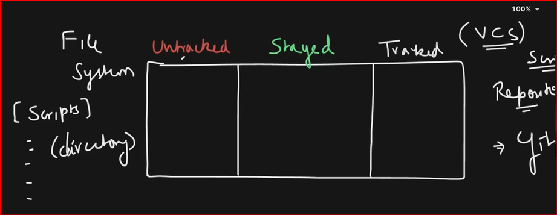
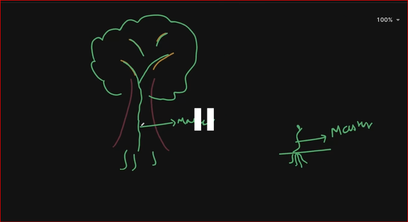
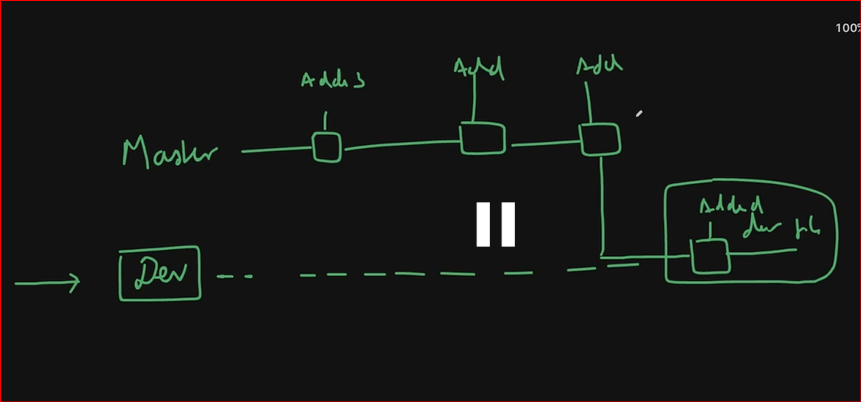

# To initialize a empty directory
git init

# To check the .git is created as a hidden file
ls -a 

# To check git status
git status

# To add file into staged
git add filename

# To commit the file into tracked
git commit -m "commit message"

# To configure author name and email id
git config --global user.name "Your Name"
git config --global user.email "you@example.com"

# View commit history
git log                     

# Condensed log
git log --oneline           

# Show specific commit
git show <commit>           

# Branch 

# List branches
git branch

# Switch to branch
git checkout <name>

# Create a new branch and switch
git checkout -b <name>

# Branch commit image

# Merge branch into current
git merge <branch>          

