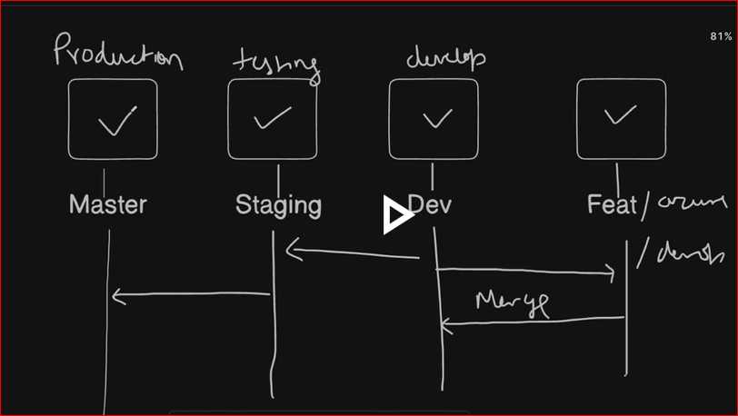
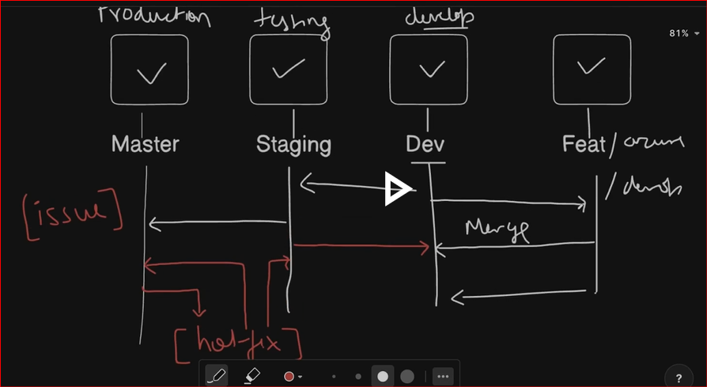

# To acces GitHub
PAT and SSH key

# Show remotes
git remote -v

# Add remote
git remote add origin <url> 

# Push branch to remote (but github not allowing password as per their release note)
git push origin <branch>

# To avoiding the Password we use PAT
git remote set-url origin https://<PAT>@github.com/subhomit-sudo/Git-and-Github-for-DevOps.git

# Fetch and merge from remote
git pull                    

# To access GitHub with SSH key
1. First create ssh key by # ssh-keygen
2. Copy the Public key from .ssh folder and paste to Github SSH
3. And now you can push and pull any repository (Public or Private)

# Branching strategy

